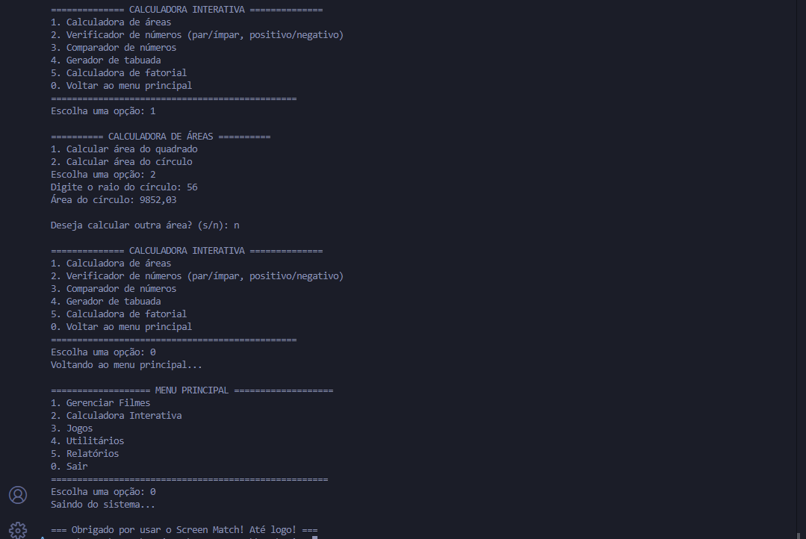

# Screen Match

[](https://github.com/ESousa97/screen-match/actions/workflows/ci.yml)
[](LICENSE)
[](https://openjdk.org/)
[](https://maven.apache.org/)
[](https://www.codefactor.io/repository/github/esousa97/screen-match)

Aplicação interativa de console em Java para gerenciamento de filmes e exercícios de fundamentos da linguagem.

<div align="center">



</div>

## Sobre o Projeto

O **Screen Match** é um sistema interativo que integra um catálogo de filmes com exercícios práticos de Java. Através de um menu de console, o usuário pode:

- **Gerenciar filmes** — cadastrar, avaliar, buscar e filtrar
- **Calculadora** — áreas, fatorial, tabuada, comparação numérica
- **Jogos** — adivinhação, quiz de filmes, contador interativo
- **Utilitários** — conversor de temperatura, calculadora de idade, gerador de senhas
- **Relatórios** — estatísticas do catálogo, ranking, filmes por década

Cada exercício também pode ser executado de forma independente para estudo isolado de conceitos Java.

## Pré-requisitos

- **JDK 17** ou superior ([Temurin](https://adoptium.net/), [Corretto](https://aws.amazon.com/corretto/), etc.)
- **Maven 3.9+** ([Download](https://maven.apache.org/download.cgi))
- **Git** ([Download](https://git-scm.com/))

## Instalação e Execução

```bash
# Clonar o repositório
git clone https://github.com/ESousa97/screen-match.git
cd screen-match

# Compilar
mvn compile

# Executar a aplicação principal
mvn exec:java

# Ou compilar e gerar o JAR
mvn package
java -jar target/screen-match-1.0.0.jar
```

### Executar um exercício individual

```bash
mvn exec:java -Dexec.mainClass=com.screenmatch.exercicios.Adivinhacao
```

## Estrutura do Projeto

```
screen-match/
├── pom.xml                       # Build Maven + dependências
├── checkstyle.xml                # Regras de linting
├── .github/                      # CI/CD e templates
│   ├── workflows/ci.yml
│   ├── dependabot.yml
│   └── ISSUE_TEMPLATE/
└── src/
    ├── main/java/com/screenmatch/
    │   ├── ScreenMatchApp.java   # Entry point
    │   ├── model/
    │   │   └── Filme.java        # Entidade filme
    │   ├── menu/                 # Menus do sistema
    │   │   ├── MenuPrincipal.java
    │   │   ├── MenuFilmes.java
    │   │   ├── MenuCalculadora.java
    │   │   ├── MenuJogos.java
    │   │   ├── MenuUtilitarios.java
    │   │   └── MenuRelatorios.java
    │   ├── util/
    │   │   └── InputUtils.java   # Utilitários de input
    │   └── exercicios/           # Exercícios standalone
    │       ├── Adivinhacao.java
    │       ├── CalculadoraFatorial.java
    │       ├── CalculoArea.java
    │       └── ...
    └── test/java/com/screenmatch/
        ├── model/FilmeTest.java
        └── menu/MenuCalculadoraTest.java
```

## Comandos Úteis

| Comando                     | Descrição                          |
| :-------------------------- | :--------------------------------- |
| `mvn compile`               | Compila o projeto                  |
| `mvn test`                  | Executa os testes                  |
| `mvn package`               | Gera o JAR executável              |
| `mvn exec:java`             | Executa a aplicação principal      |
| `mvn checkstyle:check`      | Verifica estilo do código          |

## Tecnologias

- **Java 17** — Linguagem principal (Text Blocks, Switch Expressions)
- **Maven** — Build e gerenciamento de dependências
- **JUnit 5** — Testes unitários
- **Checkstyle** — Linting e padronização de código
- **GitHub Actions** — CI/CD (build, test, lint)

## Contribuindo

Contribuições são bem-vindas! Consulte [CONTRIBUTING.md](CONTRIBUTING.md) para diretrizes.

**Resumo rápido:**

1. Fork o repositório
2. Crie uma branch (`git checkout -b feature/nova-funcionalidade`)
3. Faça commits seguindo [Conventional Commits](https://www.conventionalcommits.org/)
4. Abra um Pull Request

## Licença

Distribuído sob a licença MIT. Veja [LICENSE](LICENSE) para mais detalhes.

## Autor

**Enoque Sousa** — [LinkedIn](https://www.linkedin.com/in/enoque-sousa-bb89aa168/) · [GitHub](https://github.com/ESousa97)
