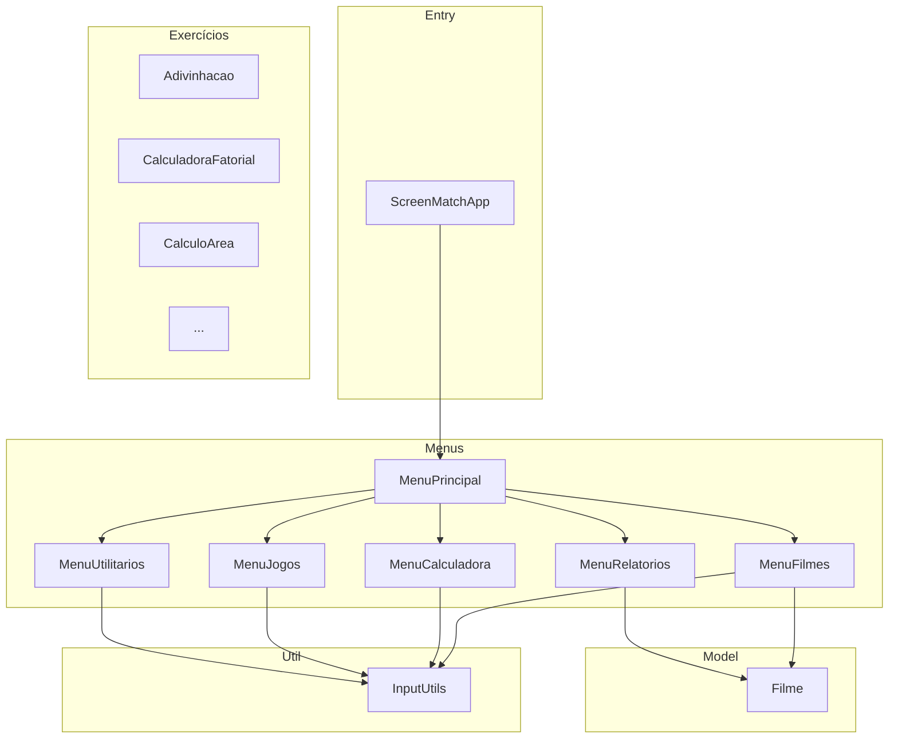

<div align="center">

# Screen Match

[](https://github.com/ESousa97/screen-match/actions/workflows/ci.yml)
[](https://www.codefactor.io/repository/github/esousa97/screen-match)
[](https://opensource.org/licenses/MIT)
[](#)

**Aplicação interativa de console em Java para gerenciamento de catálogo de filmes e exercícios práticos de fundamentos da linguagem — menu principal com 5 submódulos (Filmes, Calculadora, Jogos, Utilitários, Relatórios), entidade `Filme` com avaliação e classificação, exercícios standalone executáveis individualmente, build com Maven, testes com JUnit 5, Checkstyle e CI via GitHub Actions.**

</div>

---

> **⚠️ Projeto Arquivado**
> Este projeto não recebe mais atualizações ou correções. O código permanece disponível como referência e pode ser utilizado livremente sob a licença MIT. Fique à vontade para fazer fork caso deseje continuar o desenvolvimento.

---

<div align="center">


</div>

---

## Índice

- [Sobre o Projeto](#sobre-o-projeto)
- [Funcionalidades](#funcionalidades)
- [Tecnologias](#tecnologias)
- [Arquitetura](#arquitetura)
- [Estrutura do Projeto](#estrutura-do-projeto)
- [Começando](#começando)
  - [Pré-requisitos](#pré-requisitos)
  - [Instalação](#instalação)
  - [Uso](#uso)
- [Scripts Disponíveis](#scripts-disponíveis)
- [Testes](#testes)
- [FAQ](#faq)
- [Licença](#licença)
- [Contato](#contato)

---

## Sobre o Projeto

Sistema interativo de console que integra um catálogo de filmes com exercícios práticos de Java. O menu principal organiza as funcionalidades em 5 submódulos, e cada exercício também pode ser executado de forma independente para estudo isolado de conceitos específicos.

O repositório prioriza:

- **Arquitetura por menus** — `ScreenMatchApp` como entry point delega para 5 classes de menu especializadas (`MenuFilmes`, `MenuCalculadora`, `MenuJogos`, `MenuUtilitarios`, `MenuRelatorios`), cada uma encapsulando sua lógica e subopções
- **Entidade Filme** — Modelo com atributos para cadastro, avaliação e classificação, permitindo operações de CRUD, busca, filtragem e geração de estatísticas
- **Exercícios standalone** — Classes independentes em `com.screenmatch.exercicios` com `main()` próprio, executáveis individualmente via `mvn exec:java -Dexec.mainClass=...`
- **Utilitários de input** — `InputUtils` centraliza leitura de entrada do console, seguindo o mesmo padrão de Scanner compartilhado
- **Qualidade** — Checkstyle para padronização, JUnit 5 para testes unitários, CI com GitHub Actions

---

## Funcionalidades

- **Gerenciamento de Filmes** — Cadastrar, avaliar, buscar e filtrar filmes no catálogo em memória
- **Calculadora** — Cálculo de áreas, fatorial, tabuada e comparação numérica
- **Jogos** — Jogo de adivinhação, quiz de filmes e contador interativo
- **Utilitários** — Conversor de temperatura, calculadora de idade e gerador de senhas
- **Relatórios** — Estatísticas do catálogo, ranking de filmes e filtragem por década
- **Exercícios Standalone** — Cada exercício (`Adivinhacao`, `CalculadoraFatorial`, `CalculoArea`, etc.) pode ser executado independentemente para estudo de conceitos isolados

---

## Tecnologias


**Dependências:** JDK 17+ (Text Blocks, Switch Expressions), Maven 3.9+, JUnit 5 (test), Checkstyle (análise estática).

---

## Arquitetura



### Camadas

| Pacote | Responsabilidade |
| --- | --- |
| `com.screenmatch` | Entry point (`ScreenMatchApp`) |
| `com.screenmatch.menu` | 6 classes de menu — principal + 5 submódulos especializados |
| `com.screenmatch.model` | Entidade `Filme` com atributos e lógica de domínio |
| `com.screenmatch.util` | `InputUtils` — leitura centralizada de entrada do console |
| `com.screenmatch.exercicios` | Exercícios standalone com `main()` próprio |

---

## Estrutura do Projeto

```
screen-match/
├── src/
│   ├── main/java/com/screenmatch/
│   │   ├── ScreenMatchApp.java             # Entry point
│   │   ├── model/
│   │   │   └── Filme.java                  # Entidade filme (cadastro, avaliação)
│   │   ├── menu/
│   │   │   ├── MenuPrincipal.java          # Menu raiz com navegação
│   │   │   ├── MenuFilmes.java             # CRUD e busca de filmes
│   │   │   ├── MenuCalculadora.java        # Áreas, fatorial, tabuada
│   │   │   ├── MenuJogos.java              # Adivinhação, quiz, contador
│   │   │   ├── MenuUtilitarios.java        # Temperatura, idade, senhas
│   │   │   └── MenuRelatorios.java         # Estatísticas, ranking, por década
│   │   ├── util/
│   │   │   └── InputUtils.java             # Leitura centralizada de input
│   │   └── exercicios/
│   │       ├── Adivinhacao.java            # Jogo de adivinhação (standalone)
│   │       ├── CalculadoraFatorial.java    # Cálculo de fatorial (standalone)
│   │       ├── CalculoArea.java            # Cálculo de áreas (standalone)
│   │       └── ...                         # Outros exercícios standalone
│   └── test/java/com/screenmatch/
│       ├── model/
│       │   └── FilmeTest.java              # Testes da entidade Filme
│       └── menu/
│           └── MenuCalculadoraTest.java    # Testes da calculadora
├── assets/
│   └── screen_match1.png                   # Screenshot do sistema
├── .github/
│   ├── workflows/
│   │   └── ci.yml                          # Build + Test + Checkstyle
│   ├── dependabot.yml
│   └── ISSUE_TEMPLATE/
├── pom.xml                                 # Build config (JDK 17, JUnit 5)
├── checkstyle.xml                          # Regras de linting
├── CONTRIBUTING.md
├── LICENSE                                 # MIT
└── README.md
```

---

## Começando

### Pré-requisitos

```bash
java -version   # JDK 17 ou superior
mvn -v          # Maven 3.9+
```

### Instalação

```bash
git clone https://github.com/ESousa97/screen-match.git
cd screen-match
mvn compile
```

### Uso

**Aplicação principal (menu interativo):**

```bash
mvn exec:java
```

**Via JAR:**

```bash
mvn package
java -jar target/screen-match-1.0.0.jar
```

**Exercício individual (standalone):**

```bash
mvn exec:java -Dexec.mainClass=com.screenmatch.exercicios.Adivinhacao
```

---

## Scripts Disponíveis

```bash
# Compilar
mvn compile

# Executar testes unitários
mvn test

# Gerar JAR executável
mvn package

# Executar aplicação principal
mvn exec:java

# Verificar estilo de código
mvn checkstyle:check
```

---

## Testes

```bash
mvn test
```

Testes unitários com JUnit 5:

- **FilmeTest** — Testes da entidade Filme (cadastro, avaliação, classificação)
- **MenuCalculadoraTest** — Testes das operações da calculadora (áreas, fatorial, tabuada)

---

## FAQ

<details>
<summary><strong>Qual a diferença entre executar via menu e via exercício standalone?</strong></summary>

O `mvn exec:java` (ou o JAR) inicia o `ScreenMatchApp` com o menu principal completo, onde todas as funcionalidades estão organizadas em submódulos. Para estudar um conceito isolado, cada classe em `com.screenmatch.exercicios` tem seu próprio `main()` e pode ser executada diretamente com `mvn exec:java -Dexec.mainClass=com.screenmatch.exercicios.NomeDaClasse`.
</details>

<details>
<summary><strong>Os filmes são persistidos em banco de dados?</strong></summary>

Não. O catálogo é mantido em memória durante a execução. Ao encerrar a aplicação, os dados são perdidos. O foco do projeto é exercitar fundamentos de Java, não persistência de dados.
</details>

<details>
<summary><strong>Posso usar JDK 21 ou superior?</strong></summary>

Sim. O projeto requer JDK 17 como mínimo (para features como Text Blocks e Switch Expressions), mas é compatível com versões superiores.
</details>

<details>
<summary><strong>Como adicionar um novo exercício?</strong></summary>

Crie uma nova classe em `src/main/java/com/screenmatch/exercicios/` com um método `public static void main(String[] args)`. O exercício poderá ser executado com `mvn exec:java -Dexec.mainClass=com.screenmatch.exercicios.SuaClasse`.
</details>

---

## Licença

Este projeto está sob a licença MIT. Veja o arquivo [LICENSE](LICENSE) para mais detalhes.

```
MIT License - você pode usar, copiar, modificar e distribuir este código.
```

---

## Contato

**José Enoque Costa de Sousa**

[](https://www.linkedin.com/in/enoque-sousa-bb89aa168/)
[](https://github.com/ESousa97)
[](https://enoquesousa.vercel.app)

---

<div align="center">

**[⬆ Voltar ao topo](#screen-match)**

Feito com ❤️ por [José Enoque](https://github.com/ESousa97)

**Status do Projeto:** Archived — Sem novas atualizações

</div>