# Screen Match Interativo: Coleção de Exercícios e Aplicação de Gerenciamento de Filmes em Java

"Explorando os Fundamentos de Java através de um Catálogo de Filmes e Ferramentas Interativas."

## Abstract

Este projeto, denominado "Screen Match Interativo", é uma iniciativa educacional e prática desenvolvida em Java, focada na consolidação de conceitos fundamentais da linguagem. Ele aborda a necessidade de uma aplicação prática para exercitar e demonstrar o uso de estruturas de controle, tipos de dados, entrada/saída de dados (I/O) via console, e princípios de Programação Orientada a Objetos (POO). A solução proposta é um sistema modular que integra uma aplicação central de gerenciamento de filmes com diversos programas utilitários independentes, cada um focado em um conceito Java específico. A metodologia emprega uma abordagem interativa baseada em console, utilizando a classe `Scanner` para entrada de usuário e implementando lógicas de negócios e jogos simples. Os resultados alcançados demonstram a capacidade de construir aplicações Java funcionais a partir do zero, proporcionando uma plataforma robusta para aprendizado e experimentação. A principal contribuição deste projeto reside em sua estrutura pedagógica, que permite aos desenvolvedores explorar e aplicar conceitos de Java de forma incremental e coesa, unindo exercícios isolados em uma experiência de usuário interativa e unificada.

## Badges Abrangentes

[](https://github.com/ESousa97/screen-match/blob/main/LICENSE)
[](https://github.com/ESousa97/screen-match/)
[](https://github.com/ESousa97/screen-match/issues)
[](https://github.com/ESousa97/screen-match/pulls)
[](https://github.com/ESousa97/screen-match/commits/main)
[](https://github.com/ESousa97/screen-match/)

## Sumário
- [Abstract](#abstract)
- [Badges Abrangentes](#badges-abrangentes)
- [Sumário](#sumário)
- [Introdução e Motivação](#introdução-e-motivação)
- [Arquitetura do Sistema](#arquitetura-do-sistema)
- [Decisões de Design Chave](#decisões-de-design-chave)
- [✨ Funcionalidades Detalhadas](#-funcionalidades-detalhadas)
- [🛠️ Tech Stack Detalhado](#️-tech-stack-detalhado)
- [📂 Estrutura Detalhada do Código-Fonte](#-estrutura-detalhada-do-código-fonte)
- [📋 Pré-requisitos Avançados](#-pré-requisitos-avançados)
- [🚀 Guia de Instalação e Configuração Avançada](#-guia-de-instalação-e-configuração-avançada)
- [⚙️ Uso Avançado e Exemplos](#️-uso-avançado-e-exemplos)
- [🔧 API Reference](#-api-reference)
- [🧪 Estratégia de Testes e Qualidade de Código](#-estratégia-de-testes-e-qualidade-de-código)
- [🚢 Deployment Detalhado e Escalabilidade](#-deployment-detalhado-e-escalabilidade)
- [📜 Licença e Aspectos Legais](#-licença-e-aspectos-legais)
- [📚 Publicações, Artigos e Citações](#-publicações-artigos-e-citações)
- [👥 Equipe Principal e Colaboradores Chave](#-equipe-principal-e-colaboradores-chave)
- [❓ FAQ (Perguntas Frequentes)](#-faq-perguntas-frequentes)
- [📞 Contato e Suporte](#-contato-e-suporte)

## Introdução e Motivação

No processo de aprendizado de qualquer linguagem de programação, a transição da teoria para a prática é fundamental. Muitas vezes, exercícios isolados, embora eficazes para ensinar conceitos específicos, não proporcionam uma visão holística de como esses conceitos se integram em uma aplicação maior e funcional. O projeto "Screen Match Interativo" surge dessa lacuna, com a motivação de oferecer uma experiência de aprendizado mais coesa e envolvente para desenvolvedores Java.

Este projeto visa não apenas demonstrar a aplicação de fundamentos como estruturas de decisão (if/else, switch), laços de repetição (for, while), manipulação de entrada/saída (Scanner) e tipos de dados, mas também como esses elementos podem ser orquestrados em um sistema interativo maior. A ideia central é consolidar diversos "mini-programas" — que poderiam ser exercícios avulsos — sob a égide de uma aplicação principal de gerenciamento de filmes.

A proposta de valor única do Screen Match Interativo reside em sua natureza dual: atua como um repositório de exemplos claros e concisos de fundamentos de Java e, simultaneamente, como uma aplicação unificada que permite ao usuário interagir com essas funcionalidades através de um menu intuitivo. Isso não só facilita a compreensão de como diferentes componentes podem colaborar, mas também serve como um trampolim para projetos mais complexos, onde a modularidade e a interação entre partes são cruciais. A motivação de longo prazo é capacitar os desenvolvedores a construir sistemas robustos, começando pelos alicerces da linguagem.

## Visão demo

<div align="center">


</div>

## Arquitetura do Sistema

O projeto "Screen Match Interativo" adota uma arquitetura monolítica e modular, centrada em uma aplicação principal interativa via console. Embora simples, essa estrutura foi projetada para demonstrar a organização de código e a integração de funcionalidades distintas em um único ponto de entrada.

### Componentes Arquiteturais Principais:

1.  **`ScreenMatchInterativo` (src/main/main.java):** Este é o coração do sistema. Atua como o orquestrador principal, apresentando um menu interativo ao usuário. Ele gerencia o fluxo de controle, direcionando as requisições do usuário para os módulos de funcionalidade apropriados. É responsável pela inicialização da aplicação, gerenciamento do ciclo de vida dos dados (filmes) e interação com o usuário.
2.  **Módulos de Funcionalidade (`src/*.java`):** Cada arquivo `.java` diretamente sob `src/` (ex: `Adivinhacao.java`, `CalculaFatorial.java`, `CalculoArea.java`, `Taubada.java`, etc.) representa um módulo funcional autônomo. Originalmente, são exercícios isolados que demonstram conceitos específicos de Java. No contexto do `ScreenMatchInterativo`, eles são invocados como sub-programas ou utilitários através do menu principal.
3.  **Modelo de Dados (`Filme` - classe interna em `ScreenMatchInterativo`):** Representa a entidade central do subsistema de gerenciamento de filmes. Contém atributos como nome, ano de lançamento, nota, gênero, e uma lista de avaliações. Inclui métodos para adicionar avaliações e calcular a média, encapsulando a lógica de negócio básica.
4.  **Interface de Usuário (Console I/O):** A interação com o usuário é totalmente baseada em console, utilizando a classe `java.util.Scanner` para entrada de dados e `System.out.println` para saída.

### Interações e Fluxo de Dados:

O fluxo de controle inicia no método `main` da classe `ScreenMatchInterativo`. O usuário é apresentado a um menu principal. Com base na opção selecionada, o `ScreenMatchInterativo` invoca o método estático `main` (ou outros métodos auxiliares) do módulo de funcionalidade correspondente. Os dados (como filmes e avaliações) são mantidos em memória (`ArrayList`) enquanto a aplicação está em execução. Não há persistência de dados em banco de dados ou arquivos neste momento.

### Diagrama de Arquitetura:

```mermaid
graph TD
    A[👤 Usuário] --> B{🎬 ScreenMatchInterativo<br/>main.java}
    
    B --> M1[📱 Menu Principal]
    M1 --> M2[🎭 Gerenciar Filmes]
    M1 --> M3[🧮 Calculadora]
    M1 --> M4[🎮 Jogos]
    M1 --> M5[🛠️ Utilitários]
    M1 --> M6[📊 Relatórios]
    
    %% Módulo Filmes
    M2 --> F1[📋 Listar Filmes]
    M2 --> F2[➕ Adicionar Filme]
    M2 --> F3[⭐ Avaliar Filme]
    M2 --> F4[🔍 Buscar Filme]
    M2 --> F5[📅 Filtrar por Ano]
    M2 --> F6[✅ Verificar Disponibilidade]
    
    F1 --> DB[(🎬 Catálogo de Filmes<br/>List&lt;Filme&gt;)]
    F2 --> DB
    F3 --> DB
    F4 --> DB
    F5 --> DB
    F6 --> DB
    
    DB --> FILME[🎯 Classe Filme<br/>- nome: String<br/>- anoLancamento: int<br/>- genero: String<br/>- incluidoNoPlano: boolean<br/>- avaliacoes: List&lt;Double&gt;<br/>- nota: double]
    
    %% Módulo Calculadora
    M3 --> C1[📐 Calculadora de Áreas]
    M3 --> C2[🔢 Verificador de Números]
    M3 --> C3[⚖️ Comparador de Números]
    M3 --> C4[✖️ Gerador de Tabuada]
    M3 --> C5[❗ Calculadora de Fatorial]
    
    %% Módulo Jogos
    M4 --> J1[🎯 Jogo de Adivinhação]
    M4 --> J2[❓ Quiz de Filmes]
    M4 --> J3[🔢 Contador Interativo]
    
    %% Módulo Utilitários
    M5 --> U1[🌡️ Conversor de Temperatura]
    M5 --> U2[🎂 Calculadora de Idade]
    M5 --> U3[🔐 Gerador de Senhas]
    M5 --> U4[📅 Dia da Semana]
    
    %% Módulo Relatórios
    M6 --> R1[📄 Relatório Completo]
    M6 --> R2[📈 Estatísticas do Catálogo]
    M6 --> R3[🏆 Top Filmes]
    M6 --> R4[📊 Filmes por Década]
    M6 --> R5[💰 Relatório de Disponibilidade]
    
    %% Exercícios Originais Integrados
    J1 -.-> O1[Original: Adivinhacao.java]
    C5 -.-> O2[Original: CalculaFatorial.java]
    C1 -.-> O3[Original: CalculoArea.java]
    C2 -.-> O4[Original: Polaridade.java]
    C2 -.-> O5[Original: VerificadorParImpar.java]
    C3 -.-> O6[Original: TratamentoNumeros.java]
    C4 -.-> O7[Original: Taubada.java]
    U4 -.-> O8[Original: Case.java]
    
    %% Styling
    classDef userClass fill:#e1f5fe,stroke:#01579b,stroke-width:3px
    classDef mainClass fill:#fff3e0,stroke:#e65100,stroke-width:3px
    classDef menuClass fill:#f3e5f5,stroke:#4a148c,stroke-width:2px
    classDef moduleClass fill:#e8f5e8,stroke:#1b5e20,stroke-width:2px
    classDef dataClass fill:#ffebee,stroke:#b71c1c,stroke-width:3px
    classDef originalClass fill:#fafafa,stroke:#424242,stroke-width:1px,stroke-dasharray: 5 5
    
    class A userClass
    class B mainClass
    class M1,M2,M3,M4,M5,M6 menuClass
    class F1,F2,F3,F4,F5,F6,C1,C2,C3,C4,C5,J1,J2,J3,U1,U2,U3,U4,R1,R2,R3,R4,R5 moduleClass
    class DB,FILME dataClass
    class O1,O2,O3,O4,O5,O6,O7,O8 originalClass
```



### Decisões Arquiteturais Chave e Justificativas:

*   **Arquitetura Monolítica:** A escolha por uma arquitetura monolítica (todos os componentes em um único projeto/JAR) foi motivada pela simplicidade e pelo foco pedagógico. Para um projeto que visa ensinar fundamentos, a complexidade de microserviços ou arquiteturas distribuídas seria contraproducente. O trade-off é a menor escalabilidade horizontal e a forte coesão entre os módulos, mas isso é aceitável para o escopo atual.
*   **Modularização por Arquivo:** Cada exercício individual foi mantido em seu próprio arquivo `.java`. Isso facilita a compreensão isolada de cada conceito e permite que sejam executados de forma independente para fins de estudo. A integração ocorre através de chamadas de método no `ScreenMatchInterativo`, demonstrando um padrão básico de organização de código.
*   **Persistência em Memória:** A decisão de não utilizar um banco de dados ou persistência em arquivos simplifica o setup do projeto, permitindo que o foco permaneça nos conceitos de Java e na lógica da aplicação. O trade-off é a perda de dados ao encerrar o programa, mas para um ambiente de aprendizado e demonstração, isso é aceitável.

## Decisões de Design Chave

As decisões de design neste projeto foram guiadas principalmente pela sua natureza didática e pelo objetivo de demonstrar conceitos fundamentais de Java de forma clara e eficaz.

1.  **Linguagem de Programação: Java (JDK 17+)**
    *   **Requisito/Restrição:** O projeto foi concebido para ser uma coleção de exercícios e uma aplicação em Java. A escolha da versão 17+ (inferida pelo uso de Text Blocks em `Main.java`) permite o uso de recursos modernos da linguagem.
    *   **Alternativas Consideradas:** Nenhuma, pois o objetivo era especificamente Java.
    *   **Justificativa:** Java é uma linguagem robusta, multiplataforma, orientada a objetos e amplamente utilizada na indústria, tornando-a uma excelente escolha para o aprendizado de programação. Sua tipagem forte e o ecossistema maduro oferecem um ambiente estável para o desenvolvimento.

2.  **Interface de Usuário: Console-Based I/O**
    *   **Requisito/Restrição:** Simplicidade, portabilidade e foco nos fundamentos da linguagem sem a complexidade de frameworks de UI.
    *   **Alternativas Consideradas:** JavaFX, Swing (para GUIs).
    *   **Justificativa:** A interação via console com `java.util.Scanner` é a forma mais direta e fundamental de lidar com entrada e saída de dados em Java. Isso permite que os desenvolvedores se concentrem na lógica do programa e nos conceitos da linguagem, sem a curva de aprendizado adicional de uma biblioteca gráfica.

3.  **Estruturas de Dados Primárias: `ArrayList`**
    *   **Requisito/Restrição:** Necessidade de coleções dinâmicas para armazenar objetos (`Filme`) e valores (`double` para avaliações).
    *   **Alternativas Consideradas:** Arrays (fixos em tamanho), `LinkedList` (diferentes características de performance para inserção/acesso).
    *   **Justificativa:** `ArrayList` oferece uma implementação de lista dinâmica e flexível, ideal para o gerenciamento de coleções de objetos onde o tamanho pode variar. Sua simplicidade e desempenho para a maioria das operações de acesso e adição (no contexto deste projeto) a tornam uma escolha eficiente.

4.  **Modularização de Exercícios: Arquivos `.java` Separados**
    *   **Requisito/Restrição:** Cada conceito ou problema (ex: fatorial, adivinhação) deveria ser um programa autônomo para facilitar o estudo.
    *   **Alternativas Consideradas:** Uma única classe `Main` com múltiplos métodos estáticos para cada exercício.
    *   **Justificativa:** Separar cada exercício em seu próprio arquivo `.java` com seu próprio método `main` permite que cada um seja executado de forma independente. Isso é pedagogicamente vantajoso, pois isola o escopo de cada desafio. A classe `ScreenMatchInterativo` então atua como um agregador, chamando esses módulos, demonstrando como programas menores podem ser combinados.

5.  **Encapsulamento Básico: Classe `Filme`**
    *   **Requisito/Restrição:** Representar uma entidade do mundo real (filme) com seus atributos e comportamentos.
    *   **Alternativas Consideradas:** Usar apenas variáveis primitivas soltas (totalmente desaconselhável para este domínio).
    *   **Justificativa:** A criação da classe `Filme` demonstra os princípios fundamentais da Programação Orientada a Objetos (POO), incluindo encapsulamento (atributos privados, métodos públicos para acesso e modificação) e comportamento (adicionar avaliação, calcular média). Isso é crucial para organizar o código e modelar o domínio de forma eficaz.

## ✨ Funcionalidades Detalhadas

O projeto "Screen Match Interativo" é dividido em uma aplicação principal de gerenciamento de filmes e uma coleção de módulos de utilidades e jogos, acessíveis via um menu interativo.

### Módulo Principal: Screen Match Interativo (`src/main/main.java`)

Este é o ponto de entrada da aplicação, oferecendo um menu principal para navegar entre as diferentes funcionalidades.

*   **1. Gerenciar Filmes:**
    *   **Propósito:** Permite ao usuário interagir com um catálogo de filmes.
    *   **Casos de Uso:**
        *   **Listar todos os filmes:** Exibe uma lista formatada de todos os filmes cadastrados, incluindo nome, ano, nota média, gênero e status de inclusão no plano.
            *   *Exemplo:* Selecionar "1. Listar todos os filmes" no submenu de Gerenciamento de Filmes.
        *   **Adicionar novo filme:** Solicita dados como nome, ano, gênero e se está incluído no plano, para criar e adicionar um novo filme ao catálogo.
            *   *Exemplo:* Selecionar "2. Adicionar novo filme", digitar "Duna", "2021", "Ficção Científica", "sim".
        *   **Avaliar filme:** Permite que o usuário selecione um filme existente e atribua uma nota (0 a 10), que será usada para recalcular a média do filme.
            *   *Exemplo:* Selecionar "3. Avaliar filme", escolher "Top Gun: Maverick", digitar "9.5".
        *   **Buscar filme por nome:** Permite encontrar filmes no catálogo a partir de uma parte do nome.
            *   *Exemplo:* Selecionar "4. Buscar filme por nome", digitar "Gun".
        *   **Filtrar filmes por ano:** Exibe apenas os filmes lançados em um ano específico.
            *   *Exemplo:* Selecionar "5. Filtrar filmes por ano", digitar "2022".
        *   **Verificar disponibilidade no plano:** Informa se um filme específico está disponível para assinantes do plano premium.
            *   *Exemplo:* Selecionar "6. Verificar disponibilidade no plano", escolher um filme e ver seu status.

*   **2. Calculadora Interativa:**
    *   **Propósito:** Agrupa diversas ferramentas matemáticas e de comparação.
    *   **Casos de Uso:**
        *   **Calcular Fatorial (`CalculaFatorial.java`):** Solicita um número e calcula seu fatorial (ex: 5! = 120).
            *   *Exemplo:* Selecionar "2. Calculadora Interativa", depois a opção de Fatorial, digitar "7".
        *   **Calcular Área (`CalculoArea.java`):** Oferece um submenu para calcular a área de um quadrado ou de um círculo.
            *   *Exemplo:* Selecionar "2. Calculadora Interativa", depois a opção de Área, escolher "1. Quadrado", digitar "5".
        *   **Tabuada (`Taubada.java`):** Solicita um número e exibe sua tabuada de 1 a 10.
            *   *Exemplo:* Selecionar "2. Calculadora Interativa", depois a opção de Tabuada, digitar "8".
        *   **Verificar Par ou Ímpar (`VerificadorParImpar.java`):** Determina se um número inteiro é par ou ímpar.
            *   *Exemplo:* Selecionar "2. Calculadora Interativa", depois a opção de Par/Ímpar, digitar "17".
        *   **Tratamento de Números (`TratamentoNumeros.java`):** Compara dois números inteiros e informa se são iguais, diferentes, ou qual é o maior.
            *   *Exemplo:* Selecionar "2. Calculadora Interativa", depois a opção de Comparar Números, digitar "10" e "20".

*   **3. Jogos:**
    *   **Propósito:** Oferece jogos simples para entretenimento e demonstração de lógica.
    *   **Casos de Uso:**
        *   **Jogo de Adivinhação (`Adivinhacao.java`):** O sistema gera um número aleatório (0-99) e o usuário tem 5 tentativas para adivinhá-lo, recebendo dicas de "maior" ou "menor".
            *   *Exemplo:* Selecionar "3. Jogos", depois a opção de Adivinhação, e começar a tentar adivinhar o número.

*   **4. Utilitários:**
    *   **Propósito:** Demonstrações de conceitos básicos de Java, como condicionais, loops e entrada de dados.
    *   **Casos de Uso:**
        *   **Verificador de Polaridade (`Polaridade.java`):** Verifica se um número é positivo, negativo ou zero.
            *   *Exemplo:* Selecionar "4. Utilitários", depois a opção de Polaridade, digitar "-5".
        *   **Leitura de Dados (`Leitura.java`):** Demonstra como ler diferentes tipos de dados (String, int, double) do console.
            *   *Exemplo:* Selecionar "4. Utilitários", depois a opção de Leitura, e seguir as instruções para digitar informações sobre treino.
        *   **Condicionais (`Condicional.java`):** Exemplo estático de uso de `if-else` para verificar ano de lançamento e inclusão no plano.
            *   *Exemplo:* Selecionar "4. Utilitários", depois a opção de Condicionais (executa automaticamente).
        *   **Switch-Case (`Case.java`):** Exemplo estático de uso de `switch-case` para determinar o nome de um dia da semana.
            *   *Exemplo:* Selecionar "4. Utilitários", depois a opção de Switch-Case (executa automaticamente).
        *   **Loop `for` (`Loop.java`):** Calcula a média de 3 avaliações de filme inseridas pelo usuário.
            *   *Exemplo:* Selecionar "4. Utilitários", depois a opção de Loop For, digitar 3 notas.
        *   **Loop `while` (`OutroLoop.java`):** Calcula a média de avaliações de filme até que o usuário digite -1.
            *   *Exemplo:* Selecionar "4. Utilitários", depois a opção de Loop While, digitar várias notas e depois -1.
        *   **Contador (`Contador.java`):** Demonstra um loop `for` simples com um contador.
            *   *Exemplo:* Selecionar "4. Utilitários", depois a opção de Contador (executa automaticamente).
        *   **Conceitos Básicos (`Main.java`):** Demonstra variáveis, tipos de dados, operações matemáticas, formatação de strings e casting.
            *   *Exemplo:* Selecionar "4. Utilitários", depois a opção de Conceitos Básicos (executa automaticamente).

*   **5. Relatórios:**
    *   **Propósito:** Funcionalidade placeholder para futuras implementações de relatórios ou análises dos dados de filmes. Atualmente, exibe uma mensagem indicando que a funcionalidade está em desenvolvimento.
    *   *Exemplo:* Selecionar "5. Relatórios".

## 🛠️ Tech Stack Detalhado

Este projeto foi desenvolvido utilizando tecnologias fundamentais do ecossistema Java, com foco na simplicidade e na demonstração de conceitos da linguagem.

| Categoria                | Tecnologia      | Versão Específica (se aplicável) | Propósito no Projeto                                                                                                    | Justificativa da Escolha                                                                                                                                                                                                                                                                     |
| :----------------------- | :-------------- | :------------------------------- | :---------------------------------------------------------------------------------------------------------------------- | :------------------------------------------------------------------------------------------------------------------------------------------------------------------------------------------------------------------------------------------------------------------------------------------- |
| **Linguagem de Programação** | Java            | JDK 17+                          | Linguagem principal para toda a lógica de negócio, interface de usuário via console e módulos de funcionalidade.      | Java é uma linguagem robusta, orientada a objetos, amplamente utilizada e com um vasto ecossistema. Sua portabilidade ("escreva uma vez, execute em qualquer lugar") e a forte tipagem a tornam ideal para o aprendizado de fundamentos de programação e para construir aplicações de larga escala. |
| **Ambiente de Desenvolvimento Integrado (IDE)** | IntelliJ IDEA   | Qualquer versão recente          | Ambiente principal para codificação, depuração, compilação e execução do projeto.                                     | Reconhecido por sua inteligência de código, refatoração avançada, depurador poderoso e integração com sistemas de build. Facilita a produtividade e a compreensão do código Java. (Inferido pelo arquivo `.iml` e `.gitignore`)                                                                   |
| **Ambiente de Desenvolvimento Integrado (IDE)** | Eclipse         | Qualquer versão recente          | Alternativa de IDE para codificação, depuração, compilação e execução do projeto.                                     | Um dos IDEs mais populares para Java, com um vasto ecossistema de plugins. Oferece um conjunto completo de ferramentas para desenvolvimento Java. (Inferido pelo `.gitignore`)                                                                                                                    |
| **Ambiente de Desenvolvimento Integrado (IDE)** | NetBeans        | Qualquer versão recente          | Alternativa de IDE para codificação, depuração, compilação e execução do projeto.                                     | Outro IDE maduro para Java, conhecido por sua simplicidade e bom suporte a projetos Maven/Gradle. (Inferido pelo `.gitignore`)                                                                                                                                                                  |
| **Ambiente de Desenvolvimento Integrado (IDE)** | VS Code         | Com extensões Java                | Alternativa de editor de código com funcionalidades de IDE para desenvolvimento Java.                                  | Leve, rápido e altamente extensível, popular para diversas linguagens. Com as extensões Java apropriadas, oferece um ambiente de desenvolvimento robusto. (Inferido pelo `.gitignore`)                                                                                                            |
| **Gerenciamento de Dependências** | Nenhum explícito | N/A                              | O projeto utiliza apenas as bibliotecas padrão do JDK.                                                                  | Para um projeto de aprendizado focado em fundamentos, a ausência de dependências externas simplifica a configuração e o foco permanece nos conceitos da linguagem Java pura, sem a necessidade de gerenciar complexidades adicionais de build.                                                      |
| **Controle de Versão** | Git             | Qualquer versão recente          | Utilizado para controle de versão do código-fonte, rastreamento de alterações e colaboração.                          | Padrão da indústria para controle de versão distribuído. Essencial para colaboração e manutenção do histórico do projeto.                                                                                                                                                                      |

## 📂 Estrutura Detalhada do Código-Fonte

A organização do código-fonte do projeto "Screen Match Interativo" reflete uma abordagem modular, onde exercícios individuais são agrupados e integrados por uma aplicação principal. A filosofia é manter a clareza e a separação de responsabilidades para facilitar o aprendizado e a manutenção.

```
screen-match-master/
├── .gitignore              # Define padrões de arquivos e diretórios a serem ignorados pelo Git. Essencial para manter o repositório limpo de arquivos gerados por IDEs (IntelliJ IDEA, Eclipse, NetBeans, VS Code) e sistemas operacionais (macOS).
├── assets/                 # Diretório para armazenar recursos visuais ou mídias relacionadas ao projeto.
│   └── screen_match1.png   # Uma imagem de exemplo, possivelmente um screenshot ou logo do projeto.
├── screen-match.iml        # Arquivo de configuração de módulo específico do IntelliJ IDEA. Contém configurações de projeto, dependências de módulos e caminhos de fonte.
└── src/                    # Diretório raiz para todo o código-fonte Java da aplicação.
    ├── Adivinhacao.java    # Implementa um jogo simples de adivinhação de números. Demonstra loops, condicionais e geração de números aleatórios.
    ├── CalculaFatorial.java# Programa para calcular o fatorial de um número inteiro não negativo. Exemplo de uso de loops e tratamento de entrada do usuário.
    ├── CalculoArea.java    # Oferece um menu para calcular a área de formas geométricas básicas (quadrado e círculo). Ilustra o uso de `switch-case` e métodos estáticos.
    ├── Case.java           # Um exemplo direto de como a estrutura de controle `switch-case` funciona em Java, mapeando números para nomes de dias da semana.
    ├── Condicional.java    # Demonstra o uso de estruturas condicionais `if-else` para lógica de decisão baseada em múltiplas variáveis.
    ├── Contador.java       # Exemplo de um loop `for` simples para contagem, com uma peculiaridade no incremento da variável de controle.
    ├── Leitura.java        # Ilustra a leitura de diferentes tipos de dados (String, int, double) a partir da entrada padrão usando `java.util.Scanner`.
    ├── Loop.java           # Demonstra o uso de um loop `for` para coletar múltiplas entradas do usuário e calcular uma média.
    ├── Main.java           # Um arquivo de demonstração de conceitos básicos de Java, incluindo declaração de variáveis, tipos de dados, operações aritméticas, concatenação de strings, Text Blocks e casting.
    ├── OutroLoop.java      # Exemplo de uso de um loop `while` para coletar entradas de usuário até uma condição de saída específica.
    ├── Polaridade.java     # Verifica se um número digitado pelo usuário é positivo, negativo ou zero, utilizando estruturas condicionais.
    ├── Taubada.java        # Gera e exibe a tabuada de um número fornecido pelo usuário, demonstrando loops e formatação de saída.
    ├── TratamentoNumeros.java # Compara dois números inteiros digitados pelo usuário e informa suas relações (igual, diferente, maior/menor).
    ├── VerificadorParImpar.java # Determina se um número inteiro é par ou ímpar utilizando o operador de módulo.
    └── main/               # Pacote principal da aplicação "Screen Match Interativo".
        └── main.java       # (Internamente a classe é `ScreenMatchInterativo`) - Este é o ponto de entrada principal e o orquestrador da aplicação. Ele integra e apresenta as funcionalidades dos outros arquivos `.java` através de um menu interativo, além de gerenciar o catálogo de filmes.
```

A estrutura foi projetada para ser intuitiva para fins de aprendizado. Os arquivos na raiz de `src/` são exemplos isolados de conceitos, enquanto `src/main/main.java` (a classe `ScreenMatchInterativo`) atua como o agregador central, demonstrando como esses conceitos podem ser combinados em uma aplicação maior e interativa.

## 📋 Pré-requisitos Avançados

Para clonar, compilar e executar o projeto "Screen Match Interativo" em seu ambiente de desenvolvimento, os seguintes pré-requisitos são necessários:

1.  **Java Development Kit (JDK):**
    *   **Versão Mínima:** JDK 17. O projeto utiliza recursos da linguagem Java 17, como Text Blocks.
    *   **Instalação:** Certifique-se de que o JDK está instalado e configurado corretamente em seu sistema. Você pode verificar a versão instalada executando `java -version` e `javac -version` no terminal.
    *   **Download:** Disponível no site oficial da Oracle ou via distribuidores OpenJDK como Adoptium Temurin, Azul Zulu, Amazon Corretto, etc.

2.  **Sistema de Controle de Versão Git:**
    *   **Versão Mínima:** Git 2.0 ou superior.
    *   **Instalação:** O Git é necessário para clonar o repositório do projeto.
    *   **Verificação:** Execute `git --version` no terminal para confirmar a instalação.

3.  **Ambiente de Desenvolvimento Integrado (IDE) para Java:**
    *   Embora o projeto possa ser compilado e executado via linha de comando, o uso de um IDE é altamente recomendado para facilitar o desenvolvimento, a depuração e a navegação pelo código.
    *   **Opções Recomendadas:**
        *   **IntelliJ IDEA Community Edition:** Altamente recomendado devido à sua inteligência de código e integração robusta com projetos Java.
        *   **Eclipse IDE for Java Developers:** Uma escolha popular e madura para desenvolvimento Java.
        *   **Apache NetBeans IDE:** Outra opção sólida para projetos Java.
        *   **Visual Studio Code com Extensões Java:** Uma alternativa leve e extensível, com o pacote de extensões Java da Microsoft.

**Variáveis de Ambiente:**
*   **`JAVA_HOME`:** Deve estar configurada para apontar para o diretório de instalação do seu JDK.
*   **`PATH`:** O diretório `bin` do seu JDK (`%JAVA_HOME%/bin` ou `$JAVA_HOME/bin`) deve estar incluído na variável de ambiente `PATH` do seu sistema para que os comandos `java` e `javac` sejam reconhecidos globalmente.

## 🚀 Guia de Instalação e Configuração Avançada

Este guia detalha os passos para configurar e executar o projeto "Screen Match Interativo" em seu ambiente de desenvolvimento.

### 1. Clonar o Repositório

Primeiro, você precisará clonar o repositório do projeto para sua máquina local. Abra seu terminal ou prompt de comando e execute o seguinte comando:

```bash
git clone https://github.com/ESousa97/screen-match.git
```

Após a clonagem, navegue até o diretório do projeto:

```bash
cd screen-match
```

### 2. Abrir o Projeto no IDE

A maneira mais recomendada de trabalhar com este projeto é abri-lo em um IDE Java. As instruções abaixo são genéricas, mas podem ter pequenas variações dependendo do seu IDE.

#### Para IntelliJ IDEA:

1.  Abra o IntelliJ IDEA.
2.  Na tela de boas-vindas, selecione "Open" ou vá em `File > Open...`.
3.  Navegue até o diretório `screen-match-master` (o diretório que você acabou de clonar) e selecione-o.
4.  O IntelliJ deve reconhecer automaticamente o projeto Java e o arquivo `.iml`. Confirme para abrir o projeto.
5.  Se solicitado, configure o JDK do projeto para o JDK 17 ou superior que você instalou. Vá em `File > Project Structure... > Project SDK` e selecione o JDK correto.

#### Para Eclipse:

1.  Abra o Eclipse.
2.  Vá em `File > Import...`.
3.  Selecione `Git > Projects from Git` e clique em `Next`.
4.  Escolha `Existing Local Repository` e clique em `Next`.
5.  Clique em `Add...`, navegue até o diretório `screen-match-master` que você clonou e clique em `Add`.
6.  Selecione o repositório recém-adicionado e clique em `Next`.
7.  Escolha `Import as general project` e clique em `Next`.
8.  Clique em `Finish`.
9.  Após a importação, você precisará converter o projeto para um projeto Java. Clique com o botão direito no projeto no `Package Explorer`, vá em `Configure > Convert to Maven Project` (se o Eclipse o reconhecer como tal) ou `Configure > Convert to Java Project`.
10. Certifique-se de que o JDK 17+ está configurado como o JRE System Library do projeto. Clique com o botão direito no projeto, vá em `Properties > Java Build Path > Libraries`, edite a "JRE System Library" para apontar para o seu JDK 17+.

#### Para VS Code (com Extensões Java):

1.  Abra o VS Code.
2.  Vá em `File > Open Folder...`.
3.  Navegue até o diretório `screen-match-master` e clique em "Select Folder".
4.  O VS Code, com as extensões Java instaladas, deve detectar automaticamente o projeto Java.
5.  Verifique se o JDK correto está sendo usado. Você pode configurar isso nas configurações do VS Code (`Ctrl+,` ou `Cmd+,`) pesquisando por "Java: Home".

### 3. Compilar e Executar o Projeto

Como este é um projeto Java simples sem um sistema de build como Maven ou Gradle (além do que o IDE pode inferir), a compilação e execução são diretas.

#### Via IDE (Recomendado):

1.  No seu IDE, localize o arquivo `src/main/main.java`. A classe principal dentro deste arquivo é `ScreenMatchInterativo`.
2.  Clique com o botão direito no arquivo `main.java` (ou na classe `ScreenMatchInterativo` dentro dele) e selecione `Run 'ScreenMatchInterativo.main()'`.
3.  O programa será executado no console do seu IDE, apresentando o menu principal do "Screen Match Interativo".

#### Via Linha de Comando (Alternativo):

1.  Certifique-se de estar no diretório raiz do projeto (`screen-match-master`).
2.  Compile os arquivos Java. Você precisará compilar todos os arquivos `.java` no diretório `src` e `src/main`.
    ```bash
    # Navegue para o diretório src
    cd src

    # Compile todos os arquivos Java. O -d bin/ cria um diretório 'bin' para os arquivos .class
    # (Você pode precisar criar o diretório 'bin' manualmente se ele não existir)
    mkdir -p ../bin
    javac -d ../bin *.java main/*.java

    # Volte para o diretório raiz do projeto
    cd ..
    ```
3.  Execute a aplicação principal. O ponto de entrada é a classe `ScreenMatchInterativo` dentro do pacote `main`.
    ```bash
    java -cp bin main.ScreenMatchInterativo
    ```
    Isso iniciará o aplicativo "Screen Match Interativo" no seu terminal.

Agora você está pronto para explorar todas as funcionalidades do projeto!

## ⚙️ Uso Avançado e Exemplos

O projeto "Screen Match Interativo" foi projetado para ser um ambiente de aprendizado e demonstração, permitindo explorar os fundamentos de Java através de diferentes cenários.

### Navegando na Aplicação Principal (`ScreenMatchInterativo`)

Ao executar `ScreenMatchInterativo` (a classe em `src/main/main.java`), você será saudado com um menu principal:

```
===============================================
          SCREEN MATCH - SISTEMA INTERATIVO
===============================================
Bem-vindo ao melhor sistema de catálogo de filmes!
Aqui você pode gerenciar filmes, avaliações e muito mais.

=================== MENU PRINCIPAL ===================
1. Gerenciar Filmes
2. Calculadora Interativa
3. Jogos
4. Utilitários
5. Relatórios
0. Sair
=====================================================
Escolha uma opção:
```

Você pode navegar entre as seções digitando o número da opção desejada.

**Exemplo de Uso do Gerenciamento de Filmes:**

1.  **Adicionar um novo filme:**
    *   No `MENU PRINCIPAL`, digite `1` (Gerenciar Filmes).
    *   No `GERENCIAMENTO DE FILMES`, digite `2` (Adicionar novo filme).
    *   Siga as instruções para inserir o nome, ano de lançamento, gênero e se o filme está incluído no plano.
        ```
        Escolha uma opção: 2
        ============= ADICIONAR NOVO FILME =============
        Digite o nome do filme: O Poderoso Chefão
        Digite o ano de lançamento: 1972
        Digite o gênero do filme: Drama
        O filme está incluído no plano? (sim/nao): sim
        Filme 'O Poderoso Chefão' adicionado com sucesso!
        ```
2.  **Avaliar um filme:**
    *   No `GERENCIAMENTO DE FILMES`, digite `3` (Avaliar filme).
    *   Será apresentada uma lista numerada dos filmes. Digite o número correspondente ao filme que deseja avaliar.
    *   Digite a nota desejada (entre 0 e 10).
        ```
        Escolha uma opção: 3
        ======== AVALIAR FILME ========
        Filmes disponíveis:
        [1] FILME: Top Gun: Maverick (2022) ...
        [2] FILME: Avatar: O Caminho da Água (2022) ...
        [3] FILME: John Wick 4 (2023) ...
        [4] FILME: Oppenheimer (2023) ...
        [5] FILME: Barbie (2023) ...
        [6] FILME: O Poderoso Chefão (1972) ...

        Digite o número do filme que deseja avaliar: 6
        Digite a avaliação para 'O Poderoso Chefão' (0-10): 9.8
        Avaliação adicionada com sucesso para 'O Poderoso Chefão'!
        ```
3.  **Listar todos os filmes (e ver a nova avaliação):**
    *   No `GERENCIAMENTO DE FILMES`, digite `1` (Listar todos os filmes).
    *   Você verá o filme "O Poderoso Chefão" com a nota média atualizada.

### Executando Módulos de Funcionalidade Individualmente

Embora o `ScreenMatchInterativo` integre todos os módulos, cada arquivo `.java` dentro de `src/` possui seu próprio método `main` e pode ser executado de forma independente. Isso é útil para focar em um conceito específico ou para depurar um módulo isoladamente.

**Exemplo de execução de `Adivinhacao.java`:**

*   **Via IDE:** No seu IDE, navegue até `src/Adivinhacao.java`, clique com o botão direito no arquivo e selecione `Run 'Adivinhacao.main()'`.
*   **Via Linha de Comando (assumindo que você compilou para o diretório `bin`):**
    ```bash
    cd screen-match-master
    java -cp bin Adivinhacao
    ```
    Isso iniciará apenas o jogo de adivinhação, sem o menu principal do Screen Match.

Essa flexibilidade permite que o projeto sirva tanto como uma aplicação interativa quanto como uma coleção de exemplos de código Java para estudo aprofundado.

## 🔧 API Reference

Este projeto, "Screen Match Interativo", é uma aplicação de console e **não expõe uma API RESTful ou qualquer outra forma de interface de programação de aplicação externa**.

A interação com o sistema é feita exclusivamente através da interface de linha de comando (CLI) ou do console do IDE, onde o usuário insere dados e recebe saídas textuais. Não há endpoints HTTP, serviços web, ou bibliotecas para serem consumidas por outras aplicações.

Portanto, esta seção não é aplicável a este projeto neste momento. Se o projeto evoluir para incluir funcionalidades de rede ou serviços, esta seção seria expandida para detalhar os endpoints, métodos, parâmetros, e formatos de requisição/resposta.

## 🧪 Estratégia de Testes e Qualidade de Código

Para o projeto "Screen Match Interativo", dado o seu escopo e propósito didático, a estratégia de testes e qualidade de código é focada na simplicidade e na validação funcional básica.

### Estratégia de Testes:

Atualmente, o projeto **não possui uma suíte de testes automatizados** (como testes unitários com JUnit, testes de integração, ou testes de ponta a ponta). A validação das funcionalidades é realizada principalmente através de:

1.  **Testes Manuais Interativos:**
    *   O principal método de verificação é a execução manual da aplicação via console. Os desenvolvedores ou usuários interagem diretamente com os menus e funcionalidades, inserindo dados e observando as saídas para garantir que o comportamento esteja de acordo com o esperado.
    *   Cada módulo de funcionalidade (e.g., `Adivinhacao.java`, `CalculaFatorial.java`) pode ser executado individualmente para testar seu comportamento isolado.

### Ferramentas e Bibliotecas de Teste:

*   Nenhuma ferramenta ou framework de teste específico (como JUnit, Mockito, Selenium) é utilizado nesta versão do projeto.

### Qualidade de Código:

A qualidade do código é mantida através de:

1.  **Clareza e Legibilidade:** O código é escrito com o objetivo de ser claro e fácil de entender, utilizando nomes de variáveis e métodos descritivos.
2.  **Comentários:** Trechos de código importantes ou complexos são acompanhados de comentários explicativos, o que é crucial para um projeto com foco educacional.
3.  **Formatação Padrão:** O uso de IDEs como IntelliJ IDEA, Eclipse ou VS Code ajuda a manter uma formatação de código consistente, o que contribui para a legibilidade.
4.  **Revisão Manual:** Embora não haja um processo formal de Code Review em um ambiente de equipe, a revisão manual do próprio código ou por pares (em um contexto de aprendizado) é incentivada para identificar potenciais problemas e melhorias.

### Considerações Futuras para Qualidade e Testes:

Para um projeto de maior escala ou com requisitos de estabilidade mais rigorosos, as seguintes práticas seriam implementadas:

*   **Testes Unitários:** Utilizar JUnit para testar métodos e classes isoladamente, garantindo que cada unidade de código funcione conforme o esperado.
*   **Testes de Integração:** Verificar a interação correta entre diferentes módulos e componentes.
*   **Integração Contínua (CI):** Configurar um pipeline de CI (ex: GitHub Actions, Jenkins) para automatizar a compilação e execução de testes a cada commit, garantindo que novas alterações não introduzam regressões.
*   **Análise Estática de Código:** Ferramentas como SonarQube ou Checkstyle poderiam ser utilizadas para identificar problemas de qualidade, segurança e conformidade com padrões de codificação.

## 🚢 Deployment Detalhado e Escalabilidade

O projeto "Screen Match Interativo" é uma aplicação de console desenvolvida em Java, o que simplifica consideravelmente seu processo de deployment e minimiza as preocupações com escalabilidade no contexto atual.

### Processo de Deployment:

O deployment deste projeto consiste basicamente em compilar o código-fonte Java em arquivos `.class` e, opcionalmente, empacotá-los em um arquivo JAR executável.

1.  **Compilação:**
    *   Como detalhado na seção de instalação, o código-fonte (`.java`) precisa ser compilado para bytecode (`.class`). Isso pode ser feito automaticamente pelo seu IDE ou manualmente via linha de comando (`javac`).
    *   **Exemplo de compilação via CLI:**
        ```bash
        # Navegue para o diretório raiz do projeto (screen-match-master)
        cd screen-match-master
        # Crie um diretório para os arquivos compilados
        mkdir -p bin
        # Compile todos os arquivos .java no diretório src e src/main, colocando os .class em 'bin'
        javac -d bin src/*.java src/main/*.java
        ```

2.  **Empacotamento (Opcional, mas Recomendado para Distribuição):**
    *   Para facilitar a distribuição e execução sem a necessidade de uma estrutura de diretórios complexa, os arquivos `.class` podem ser empacotados em um arquivo JAR (Java Archive) executável.
    *   **Exemplo de criação de JAR executável via CLI:**
        ```bash
        # Certifique-se de que está no diretório raiz do projeto
        cd screen-match-master
        # Crie o JAR executável. O 'e' especifica o ponto de entrada (main.ScreenMatchInterativo)
        jar cfe ScreenMatchInterativo.jar main.ScreenMatchInterativo -C bin .
        ```
        Este comando cria `ScreenMatchInterativo.jar` no diretório raiz do projeto.

3.  **Execução:**
    *   Uma vez compilado (e opcionalmente empacotado), o programa pode ser executado em qualquer ambiente que possua um Java Runtime Environment (JRE) compatível (JDK 17+).
    *   **Execução do JAR:**
        ```bash
        java -jar ScreenMatchInterativo.jar
        ```
    *   **Execução dos arquivos .class (se não empacotado):**
        ```bash
        java -cp bin main.ScreenMatchInterativo
        ```

### Plataformas de Deployment:

Devido à sua natureza de aplicação de console, o "Screen Match Interativo" pode ser executado em praticamente qualquer sistema operacional (Windows, macOS, Linux) que tenha um JRE instalado. Não há dependências de plataformas de nuvem específicas (como AWS, Azure, Google Cloud) ou tecnologias de containerização (como Docker/Kubernetes) para sua operação básica.

### Considerações sobre Escalabilidade:

Para o escopo atual do projeto, as preocupações com escalabilidade são mínimas:

*   **Monolítico e In-Memory:** O projeto é um monolito que mantém todos os dados em memória RAM enquanto está em execução. Isso significa que ele não escala horizontalmente (não pode ser facilmente distribuído em várias instâncias para lidar com mais carga de usuários simultâneos).
*   **Recursos:** O consumo de CPU e memória é baixo para as operações atuais, pois ele lida com um único usuário por vez e um conjunto limitado de dados de filmes.
*   **Sem Persistência:** A falta de persistência de dados significa que os dados são perdidos ao encerrar a aplicação, o que não é ideal para um sistema de produção, mas é aceitável para um projeto de aprendizado.

**Roadmap para Escalabilidade Futura (se o projeto evoluísse):**

Para escalar um projeto como este para um ambiente de produção com múltiplos usuários e persistência de dados, seriam necessárias as seguintes mudanças arquiteturais:

*   **Persistência de Dados:** Integração com um banco de dados (SQL ou NoSQL) para armazenar filmes e avaliações de forma persistente.
*   **Camada de API:** Exposição de uma API RESTful (utilizando frameworks como Spring Boot, Micronaut, Quarkus) para permitir que múltiplos clientes (web, mobile, desktop) interajam com o sistema.
*   **Containerização:** Uso de Docker para empacotar a aplicação e suas dependências, facilitando o deployment em ambientes de nuvem e orquestradores como Kubernetes.
*   **Balanceamento de Carga:** Para lidar com múltiplos usuários, instâncias da aplicação seriam executadas atrás de um balanceador de carga.
*   **Monitoramento e Logging:** Implementação de ferramentas de monitoramento (ex: Prometheus, Grafana) e logging centralizado (ex: ELK Stack) para observar o desempenho e diagnosticar problemas.

No entanto, para o objetivo atual de aprendizado e demonstração de fundamentos de Java, a simplicidade do deployment e a ausência de preocupações complexas com escalabilidade são consideradas vantagens.

## 📜 Licença e Aspectos Legais

Este projeto é distribuído sob a licença **MIT License**.

A Licença MIT é uma licença de software livre permissiva, o que significa que ela impõe restrições muito limitadas sobre a reutilização do software. Ela permite que você use, copie, modifique, mescle, publique, distribua, sublicencie e/ou venda cópias do software, e permite que pessoas para quem o software é fornecido o façam, sujeito à condição de que o aviso de direitos autorais e este aviso de permissão sejam incluídos em todas as cópias ou partes substanciais do software.

Para o texto completo da licença, consulte o arquivo [LICENSE](./LICENSE) no repositório.

**Implicações da Licença MIT:**

*   **Para Usuários:** Você tem a liberdade de usar este software para qualquer propósito, incluindo projetos comerciais, sem restrições significativas.
*   **Para Contribuidores:** Ao contribuir com este projeto, você concorda que suas contribuições serão licenciadas sob a Licença MIT.

É importante ler o texto completo da licença para entender todos os seus termos e condições.

## 📚 Publicações, Artigos e Citações

Este projeto é de natureza didática e de demonstração de código, não estando associado a publicações científicas, artigos de pesquisa ou teses acadêmicas neste momento. Portanto, não há publicações ou citações formais a serem listadas aqui.

Caso o projeto evolua para ser parte de um trabalho de pesquisa ou seja utilizado como base para publicações futuras, esta seção será atualizada para incluir as referências apropriadas.

## 👥 Equipe Principal e Colaboradores Chave

O desenvolvimento inicial e a manutenção deste projeto são liderados por:

*   **Enoque Sousa**
    *   [LinkedIn](https://www.linkedin.com/in/enoque-sousa-bb89aa168/)

Agradecemos a todos os potenciais colaboradores que desejam contribuir para o aprimoramento e expansão deste projeto. Suas contribuições são valorizadas e serão devidamente reconhecidas.


## ❓ FAQ (Perguntas Frequentes)

Esta seção aborda algumas das perguntas mais comuns sobre o projeto "Screen Match Interativo".

**1. Qual é o objetivo principal deste projeto?**
O objetivo principal é ser uma ferramenta didática para o aprendizado e a consolidação de conceitos fundamentais da linguagem Java. Ele integra diversos exercícios básicos em uma aplicação interativa de console, demonstrando como diferentes funcionalidades podem ser combinadas em um único sistema.

**2. Como eu compilo e executo o projeto?**
Você pode compilar e executar o projeto diretamente do seu Ambiente de Desenvolvimento Integrado (IDE) como IntelliJ IDEA, Eclipse ou VS Code, executando a classe `main.ScreenMatchInterativo`. Alternativamente, você pode compilar via linha de comando usando `javac` e executar com `java -cp bin main.ScreenMatchInterativo` (assumindo que você compilou para o diretório `bin`). Consulte a seção [🚀 Guia de Instalação e Configuração Avançada](#-guia-de-instalação-e-configuração-avançada) para detalhes.

**3. Os dados dos filmes são salvos?**
Não. Nesta versão do projeto, todos os dados (filmes e avaliações) são armazenados apenas na memória RAM enquanto a aplicação está em execução. Ao fechar o programa, todos os dados são perdidos. Futuramente, a persistência de dados pode ser implementada.

**4. Posso adicionar meus próprios exercícios ou funcionalidades?**
Sim, com certeza! O projeto é projetado para ser extensível. Você pode adicionar novas classes `.java` no diretório `src/` para novos exercícios e integrá-los ao menu principal da classe `main.ScreenMatchInterativo`, seguindo o padrão existente.

**5. Por que existem tantos arquivos `.java` na raiz de `src/` e um `main.java` em `src/main/`?**
Os arquivos `.java` na raiz de `src/` (como `Adivinhacao.java`, `CalculaFatorial.java`, etc.) são exemplos de exercícios individuais, cada um demonstrando um conceito específico de Java de forma isolada. O arquivo `src/main/main.java` (que contém a classe `ScreenMatchInterativo`) é a aplicação principal que orquestra e integra esses exercícios através de um menu interativo, proporcionando uma experiência de usuário mais completa.

**6. Que versão do Java é necessária?**
É necessário o Java Development Kit (JDK) versão 17 ou superior, pois o projeto utiliza recursos da linguagem introduzidos a partir dessa versão, como Text Blocks.

**7. Onde posso reportar um bug ou sugerir uma nova funcionalidade?**
Você pode reportar bugs ou sugerir funcionalidades abrindo uma [Issue no GitHub](https://github.com/ESousa97/screen-match/issues) do projeto.

**8. Este projeto tem uma interface gráfica (GUI)?**
Não, atualmente o projeto é uma aplicação de console. Toda a interação com o usuário é feita através de texto no terminal. Há planos para desenvolver uma interface gráfica em futuras versões, conforme o roadmap.

## 📞 Contato e Suporte

Para dúvidas, sugestões, ou para relatar problemas relacionados ao projeto "Screen Match Interativo", por favor, utilize os seguintes canais:

*   **Issues do GitHub:**
    *   A forma preferencial para relatar bugs, propor novas funcionalidades ou fazer perguntas técnicas sobre o código. Por favor, crie uma nova issue detalhando o problema ou a sugestão.
    *   [Acesse as Issues do Projeto](https://github.com/ESousa97/screen-match/issues)

*   **LinkedIn do Autor:**
    *   Para contato profissional ou perguntas mais gerais sobre o projeto e a experiência do autor.
    *   [Perfil de Enoque Sousa no LinkedIn](https://www.linkedin.com/in/enoque-sousa-bb89aa168/)


> ✨ **Criado em:** 22 de abr. de 2025 às 20:59
